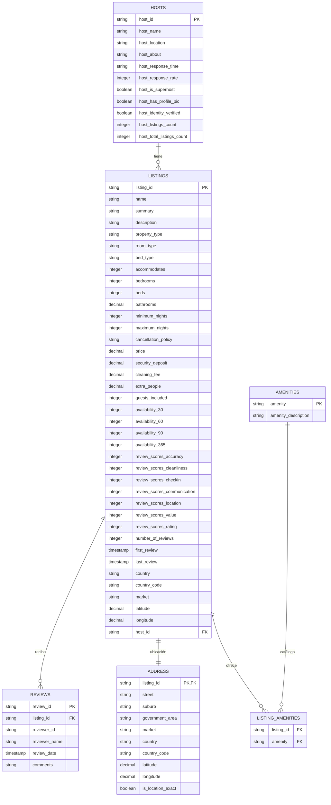
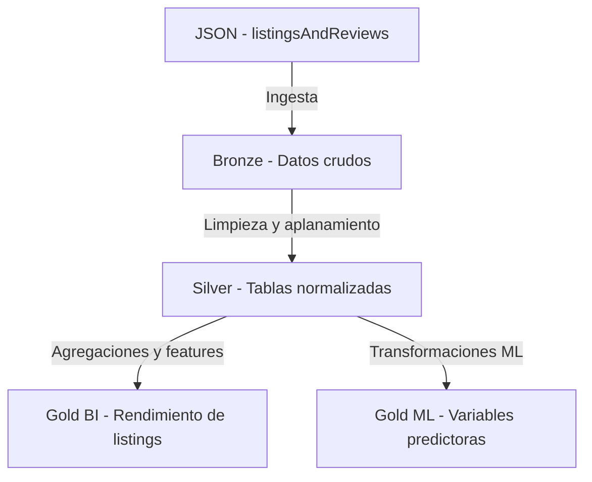

# Informe Final – Arquitectura Medallón Airbnb (Bronze, Silver y Gold)

**Curso:** Base de Datos
**Tema:** Diseño de la arquitectura Medallón (Bronze – Silver – Gold)
**Dataset:** Airbnb Listings & Reviews
**Integrantes:** *(colocar nombres del equipo)*

---

## Índice

1. [Objetivos del trabajo](#objetivos-del-trabajo)
2. [Introducción](#introducción)
3. [Capa Bronze – Datos crudos](#capa-bronze--datos-crudos)
4. [Capa Silver – Datos estructurados](#capa-silver--datos-estructurados)
5. [Capa Gold – Modelos analíticos (BI y ML)](#capa-gold--modelos-analíticos-bi-y-ml)
6. [Diagrama general de arquitectura](#diagrama-general-de-arquitectura)
7. [Decisiones clave de diseño](#decisiones-clave-de-diseño)
8. [Conclusiones](#conclusiones)
9. [Anexos – Scripts clave](#anexos--scripts-clave)

---

## Objetivos del trabajo

1. Comprender los principios y el propósito de cada capa de la arquitectura Medallón.
2. Analizar un esquema de datos JSON complejo, anidado y semi-estructurado.
3. Diseñar un modelo de datos tabular (capa Silver) limpio, validado y fuente única de la verdad.
4. Proponer modelos agregados (capa Gold) optimizados para BI y ML.
5. Justificar decisiones de diseño (normalización vs. desnormalización, aplanamiento y limpieza).
6. Colaborar en equipo para lograr consensos técnicos.

---

## Introducción

Este informe documenta la implementación de una **arquitectura Medallón (Bronze–Silver–Gold)** sobre el dataset público **Airbnb Listings & Reviews**.
El objetivo fue transformar datos **JSON anidados** en modelos tabulares confiables para **análisis de negocio (BI)** y **modelado predictivo (ML)**.

**Trazabilidad (notebooks):**
`Airbnb_01_bronze_reviews.ipynb`,
`Airbnb_02_silver_reviews_metadata.ipynb`, 
`Airbnb_02_silver_reviews_data.ipynb`, 
`Airbnb_03_gold_reviews_metadata.ipynb`, 
`Airbnb_03_gold_reviews_data.ipynb`.

---

## Capa Bronze – Datos crudos

**Descripción.** La capa Bronze conserva el **JSON original** tal cual llega del origen, con fines de trazabilidad, auditoría y reprocesos.

**Tabla propuesta:** `bronze_reviews_raw`
**Campos:** `id`, `json_raw`, `fecha_carga`, `nombre_archivo_origen`, `id_proceso`.

**Valor funcional.** Garantiza una copia exacta del dato crudo para validar, volver a procesar y comparar versiones.

---

## Capa Silver – Datos estructurados

### Entidades identificadas

Se definieron **seis** tablas funcionales:

* **HOSTS** – datos de anfitriones.
* **LISTINGS** – información del alojamiento (tabla central).
* **REVIEWS** – reseñas individuales.
* **LISTING_AMENITIES** – relación alojamiento–amenidad.
* **ADDRESS** – información geográfica y coordenadas del listing.
* **AMENITIES** – catálogo de amenidades estandarizadas.

> Implementación en: 
`Airbnb_02_silver_reviews_metadata.ipynb` `Airbnb_02_silver_reviews_data.ipynb`.

### Diagrama ER



> Nota: En la implementación real se usan claves `bk_*` (negocio) y `*_sk` (surrogate). El diagrama usa nombres funcionales para facilitar lectura. La relación **LISTINGS–ADDRESS** es 1:1.

### Reglas de limpieza y transformación

1. Conversión de `$numberDecimal`/`$numberInt` a tipos numéricos estándar.
2. Conversión de `$date` a `TIMESTAMP`.
3. Aplanamiento de objetos (host, address, review_scores).
4. Normalización de arreglos (`reviews`, `amenities`) en tablas dedicadas.
5. Limpieza de textos (saltos de línea, caracteres especiales).
6. Validación de rangos (precios > 0, ratings válidos).

### Objetivo funcional por tabla

* **HOSTS:** reputación y respuesta del anfitrión.
* **LISTINGS:** entidad central con atributos y métricas del alojamiento.
* **ADDRESS:** geoposición y contexto territorial para análisis por ubicación.
* **REVIEWS:** base temporal de satisfacción del huésped.
* **AMENITIES:** catálogo estandarizado para clasificar servicios.
* **LISTING_AMENITIES:** puente N–a–N entre listings y amenities; base de `num_amenities`.

---

## Capa Gold – Modelos analíticos (BI y ML)

### 1) Power BI – Fuente unificada

**Objetivo:** exponer una vista limpia y estable para tableros.
**Nombre final (tu versión):** `airbnb.gold.feature_bi_listing_performance`

```sql
-- ==============================================
-- GOLD / BI: Vista base para Power BI
-- Nombre: airbnb.gold.feature_bi_listing_performance
-- Objetivo: Fuente única para tableros (Import o DirectQuery)
-- Dependencias: silver.listings, silver.hosts, silver.reviews, silver.listing_amenities
-- ==============================================

CREATE SCHEMA IF NOT EXISTS airbnb.gold;

CREATE OR REPLACE VIEW airbnb.gold.feature_bi_listing_performance AS
WITH amen AS (
  SELECT
    bk_listing_id,
    COUNT(*) AS num_amenities
  FROM airbnb.silver.listing_amenities
  GROUP BY bk_listing_id
),
rev AS (
  SELECT
    bk_listing_id,
    COUNT(*)               AS total_reviews,
    MAX(review_date)       AS last_review_date
  FROM airbnb.silver.reviews
  GROUP BY bk_listing_id
)
SELECT
  -- Identidad
  l.bk_listing_id                                  AS listing_id,
  h.host_name,

  -- Dimensiones
  l.country,
  l.property_type,
  l.room_type,

  -- Métricas clave
  TRY_CAST(l.review_scores_rating AS INT)          AS avg_review_rating,
  COALESCE(r.total_reviews, 0)                     AS total_reviews,
  TRY_CAST(l.price AS DECIMAL(10,2))               AS avg_price_per_night,
  r.last_review_date,
  COALESCE(a.num_amenities, 0)                     AS num_amenities

FROM airbnb.silver.listings l
LEFT JOIN airbnb.silver.hosts h
  ON h.host_sk = l.host_sk
LEFT JOIN amen a
  ON a.bk_listing_id = l.bk_listing_id
LEFT JOIN rev r
  ON r.bk_listing_id = l.bk_listing_id
WHERE l.price IS NOT NULL
  AND TRY_CAST(l.price AS DECIMAL(10,2)) > 0;
```

---

### 2) ML – Predicción de rating

**Tabla:** `airbnb.gold.gold_ml_rating_features`
**Objetivo:** predecir `review_scores_rating` con variables de capacidad, amenities, precio y atributos del host.

```sql
-- =========================================================
-- GOLD: ML - gold_ml_rating_features
-- Objetivo: predecir review_scores_rating (target_rating)
-- =========================================================

CREATE SCHEMA IF NOT EXISTS airbnb.gold;

CREATE OR REPLACE TABLE airbnb.gold.gold_ml_rating_features AS
WITH amen AS (
  SELECT
    bk_listing_id,
    COUNT(*) AS num_amenities
  FROM airbnb.silver.listing_amenities
  GROUP BY bk_listing_id
)
SELECT
  l.bk_listing_id                                  AS listing_id,
  CAST(l.review_scores_rating AS INT)              AS target_rating,
  TRY_CAST(l.price AS DECIMAL(10,2))               AS price,
  TRY_CAST(l.accommodates AS INT)                  AS accommodates,
  TRY_CAST(l.bedrooms AS INT)                      AS bedrooms,
  TRY_CAST(l.beds AS INT)                          AS beds,
  TRY_CAST(l.bathrooms AS DECIMAL(3,1))            AS bathrooms,
  TRY_CAST(l.number_of_reviews AS INT)             AS number_of_reviews,
  COALESCE(a.num_amenities, 0)                     AS num_amenities,
  CASE
    WHEN CAST(h.host_is_superhost AS STRING) IN ('true','True','1')  THEN TRUE
    WHEN CAST(h.host_is_superhost AS STRING) IN ('false','False','0') THEN FALSE
    ELSE TRY_CAST(h.host_is_superhost AS BOOLEAN)
  END                                              AS host_is_superhost,
  l.property_type,
  l.room_type,
  l.country
FROM airbnb.silver.listings l
LEFT JOIN airbnb.silver.hosts h
  ON h.host_sk = l.host_sk
LEFT JOIN amen a
  ON a.bk_listing_id = l.bk_listing_id
WHERE l.review_scores_rating IS NOT NULL
  AND l.price IS NOT NULL
  AND TRY_CAST(l.price AS DECIMAL(10,2)) > 0;
```

---

## Diagrama general de arquitectura



---

## Decisiones clave de diseño

1. **Normalización en Silver** para separar entidades (incluyendo **ADDRESS** y **AMENITIES**) y evitar redundancia.
2. **Relación N–a–N** para amenities mediante **LISTING_AMENITIES**.
3. **Desnormalización focalizada en Gold** (vistas y features por caso de uso).
4. **Conservación del crudo en Bronze** para auditoría y reprocesos.
5. **Claves de negocio y surrogate** para estabilidad y performance entre capas.

---

## Conclusiones

La solución convierte datos JSON complejos en modelos tabulares confiables, listos para **BI** y **ML**.
El diseño incorpora **ADDRESS** y **AMENITIES** como entidades dedicadas, mejora la trazabilidad y habilita métricas comparables por ubicación y oferta de servicios.
Se cumplieron los objetivos académicos del curso con un **pipeline claro, reproducible y escalable**.

---