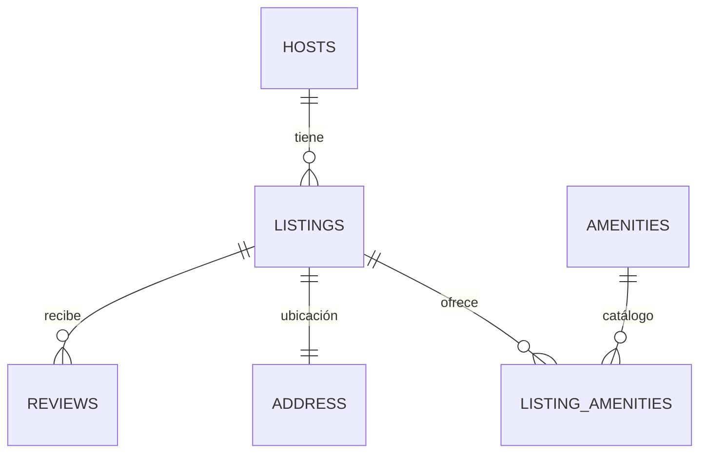
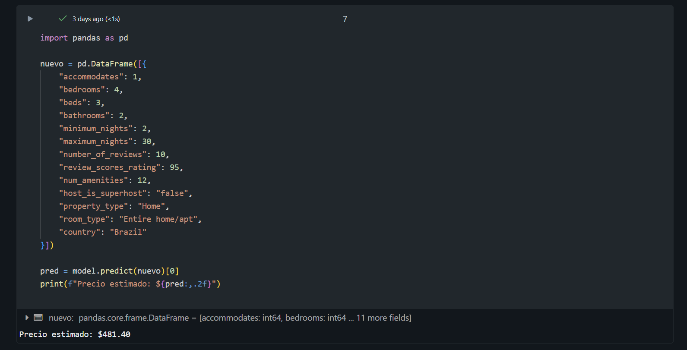

# Informe Final – Arquitectura Medallón Airbnb (Bronze · Silver · Gold)

**Universidad:** UTEC – Universidad de Ingeniería y Tecnología  
**Maestría:** Ciencia de Datos e Inteligencia Artificial  
**Curso:** Base de Datos  
**Fecha de entrega:** 05/11/2025

---

## Índice

1. [Resumen ejecutivo](#resumen-ejecutivo)
2. [Objetivos del trabajo](#objetivos-del-trabajo)
3. [Alcance y dataset](#alcance-y-dataset)
4. [Arquitectura Medallón](#arquitectura-medallón)
   1. [Capa Bronze – Datos crudos](#capa-bronze--datos-crudos)
   2. [Capa Silver – Datos estructurados](#capa-silver--datos-estructurados)
   3. [Capa Gold – Modelos analíticos (BI y ML)](#capa-gold--modelos-analíticos-bi-y-ml)
5. [Trazabilidad y estructura del proyecto](#trazabilidad-y-estructura-del-proyecto)
6. [Decisiones de diseño](#decisiones-de-diseño)
7. [Calidad de datos y validaciones](#calidad-de-datos-y-validaciones)
8. [Reproducibilidad y desempeño](#reproducibilidad-y-desempeño)
9. [Resultados y conclusiones](#resultados-y-conclusiones)

---

## Resumen ejecutivo

Se implementó una arquitectura **Medallón (Bronze → Silver → Gold)** para transformar el dataset público **Airbnb Listings & Reviews** (formato JSON anidado) en **modelos tabulares** confiables, listos para **análisis de negocio (BI)** y **modelado predictivo (ML)**.  
La propuesta garantiza **trazabilidad**, **calidad de datos**, y **reproducibilidad**, habilitando una vista de **desempeño de listings** para Power BI y un dataset **curado de features** para un modelo de predicción de **precio por noche**.

---

## Objetivos del trabajo

1. Diseñar una arquitectura Medallón que preserve el crudo, normalice entidades y exponga modelos analíticos.  
2. Analizar y aplanar **JSON complejos**, separando entidades funcionales y relaciones.  
3. Establecer **tablas Silver** como **fuente única de la verdad** (consistentes, tipadas y validables).  
4. Publicar **artefactos Gold** diferenciados para **BI** y **ML**.  
5. Documentar las **decisiones de diseño** y las **reglas de limpieza** de manera clara y académica.

---

## Alcance y dataset

- **Fuente:** Airbnb *Listings & Reviews* (archivo JSON con objetos anidados y arreglos).  
- **Alcance:** Ingesta cruda (Bronze), normalización por entidades (Silver) y productos analíticos (Gold: BI y ML).  
- **Suposiciones:** Se emplean claves de negocio `bk_*` y claves sustitutas `*_sk` para estabilidad relacional.

---

## Arquitectura Medallón

### Capa Bronze – Datos crudos

**Propósito.** Conservar el **JSON original**, sin modificaciones, con fines de **auditoría, trazabilidad y reproceso**.

**Tabla:** `bronze_reviews_raw`  
**Campos:** `id`, `json_raw`, `fecha_carga`, `nombre_archivo_origen`, `id_proceso`.

**Beneficio funcional.** Permite reproducir el pipeline, validar versiones y comparar resultados con el crudo original.

---

### Capa Silver – Datos estructurados

Se definieron **seis** entidades funcionales y sus relaciones:

- **HOSTS** – datos de anfitriones.  
- **LISTINGS** – entidad central del alojamiento.  
- **REVIEWS** – reseñas de huéspedes.  
- **LISTING_AMENITIES** – relación N–a–N entre listings y amenities.  
- **ADDRESS** – ubicación (geografía y coordenadas).  
- **AMENITIES** – catálogo normalizado de amenidades.

**Reglas de transformación (síntesis):**  
1) Conversión de `$numberDecimal`/`$numberInt` a tipos numéricos nativos.  
2) Conversión de `$date` a `TIMESTAMP`.  
3) Aplanamiento de objetos anidados (host, address, review_scores).  
4) Normalización de arreglos (`reviews`, `amenities`) a tablas dedicadas.  
5) Limpieza de textos (saltos de línea, caracteres no imprimibles).  
6) Validaciones de rango y consistencia (precios > 0, ratings válidos).

**Diagrama ER (visión funcional):**


> Nota: en la implementación real se emplean claves `bk_*` (de negocio) y `*_sk` (surrogate). La relación **LISTINGS–ADDRESS** es 1:1.

---

### Capa Gold – Modelos analíticos (BI y ML)

#### 1) Vista para BI – Rendimiento de listings

**Objetivo.** Exponer una **vista estable** y limpia como fuente para Power BI, con métricas y dimensiones esenciales.  
**Dependencias:** `silver.listings`, `silver.hosts`, `silver.reviews`, `silver.listing_amenities`.

```sql
-- ==============================================
-- GOLD / BI: Vista base para Power BI
-- Nombre: airbnb.gold.feature_bi_listing_performance
-- Objetivo: Fuente única para tableros
-- Dependencias: silver.listings, silver.hosts, silver.reviews, silver.listing_amenities
-- ==============================================

CREATE SCHEMA IF NOT EXISTS airbnb.gold;

CREATE OR REPLACE VIEW airbnb.gold.feature_bi_listing_performance AS
WITH amen AS (
  SELECT
    bk_listing_id,
    COUNT(1) AS num_amenities
  FROM airbnb.silver.listing_amenities
  GROUP BY bk_listing_id
),
rev AS (
  SELECT
    bk_listing_id,
    COUNT(1)               AS total_reviews,
    MAX(review_date)       AS last_review_date
  FROM airbnb.silver.reviews
  GROUP BY bk_listing_id
)
SELECT
  -- Identidad
  l.bk_listing_id                                  AS listing_id,
  h.host_name,

  -- Dimensiones
  l.country,
  l.property_type,
  l.room_type,

  -- Métricas clave
  TRY_CAST(l.review_scores_rating AS INT)          AS avg_review_rating,
  COALESCE(r.total_reviews, 0)                     AS total_reviews,
  TRY_CAST(l.price AS DECIMAL(10,2))               AS avg_price_per_night,
  r.last_review_date,
  COALESCE(a.num_amenities, 0)                     AS num_amenities

FROM airbnb.silver.listings l
LEFT JOIN airbnb.silver.hosts h
  ON h.host_sk = l.host_sk
LEFT JOIN amen a
  ON a.bk_listing_id = l.bk_listing_id
LEFT JOIN rev r
  ON r.bk_listing_id = l.bk_listing_id
WHERE l.price IS NOT NULL
  AND TRY_CAST(l.price AS DECIMAL(10,2)) > 0;
```

**Justificación del diseño.**  
- Se **coalesce** el conteo de amenidades y reseñas para no perder filas sin actividad.  
- Se limita a **precios válidos** para evitar outliers de nulos/cero.  
- Se ofrecen **dimensiones mínimas** (país, tipo de propiedad, tipo de habitación) útiles para segmentar en BI.

---

#### 2) Dataset para ML – Predicción de precio

**Objetivo.** Construir un dataset **curado** con **target** y **features** relevantes para entrenar modelos de **predicción de precio por noche**.

```sql
-- =========================================================
-- GOLD: ML - feature_ml_price
-- Objetivo: predecir price (target_price)
-- Fuentes: airbnb.silver.listings, airbnb.silver.hosts, airbnb.silver.listing_amenities
-- =========================================================

-- 1) Asegurar esquema Gold
CREATE SCHEMA IF NOT EXISTS airbnb.gold;

-- 2) Construcción de features + target
CREATE OR REPLACE TABLE airbnb.gold.feature_ml_price AS
WITH amen AS (
  SELECT
    bk_listing_id,
    COUNT(*) AS num_amenities
  FROM airbnb.silver.listing_amenities
  GROUP BY bk_listing_id
)
SELECT
  /* Identificador estable por clave de negocio */
  l.bk_listing_id                                   AS listing_id,

  -- ===== TARGET =====
  TRY_CAST(l.price AS DECIMAL(10,2))                AS target_price,

  -- ===== FEATURES NUMÉRICAS =====
  TRY_CAST(l.accommodates AS INT)                   AS accommodates,
  TRY_CAST(l.bedrooms AS INT)                       AS bedrooms,
  TRY_CAST(l.beds AS INT)                           AS beds,
  TRY_CAST(l.bathrooms AS DECIMAL(3,1))             AS bathrooms,
  TRY_CAST(l.minimum_nights AS INT)                 AS minimum_nights,
  TRY_CAST(l.maximum_nights AS INT)                 AS maximum_nights,
  TRY_CAST(l.number_of_reviews AS INT)              AS number_of_reviews,
  TRY_CAST(l.review_scores_rating AS DECIMAL(5,2))  AS review_scores_rating,
  COALESCE(a.num_amenities, 0)                      AS num_amenities,

  -- ===== FEATURES CATEGÓRICAS / BOOLEANAS =====
  CASE
    WHEN CAST(h.host_is_superhost AS STRING) IN ('true','True','1')  THEN TRUE
    WHEN CAST(h.host_is_superhost AS STRING) IN ('false','False','0') THEN FALSE
    ELSE TRY_CAST(h.host_is_superhost AS BOOLEAN)
  END                                               AS host_is_superhost,

  l.property_type,
  l.room_type,
  l.country

FROM airbnb.silver.listings l
LEFT JOIN airbnb.silver.hosts h
  ON h.host_sk = l.host_sk
LEFT JOIN amen a
  ON a.bk_listing_id = l.bk_listing_id

-- 3) Filtros mínimos de calidad
WHERE l.price IS NOT NULL
  AND TRY_CAST(l.price AS DECIMAL(10,2)) > 0;
```

**Criterios de inclusión.**  
- Se **normalizan** tipos y se **coalesce** el número de amenidades.  
- Se tipifica `host_is_superhost` de manera robusta frente a diferentes codificaciones.  
- Se **excluyen** registros sin precio válido para mejorar la señal del modelo.

> **Nota:** El entrenamiento y registro del modelo (e.g., `model_airbnb_price`) se realiza en un notebook aparte, usando este dataset Gold como fuente única.

---

## Estructura del proyecto

```
/ (raíz del repositorio)
├─ data/                      # fuentes crudas / intermedias (si aplica)
├─ notebooks/                 # cuadernos por fase del pipeline
│  ├─ Airbnb_01_bronze_reviews.ipynb
│  ├─ Airbnb_02_silver_reviews_metadata.ipynb
│  ├─ Airbnb_02_silver_reviews_data.ipynb
│  ├─ Airbnb_03_gold_reviews_metadata.ipynb
│  ├─ Airbnb_03_gold_reviews_data.ipynb
│  ├─ Airbnb_04_gold_feature_bi_listing_performance.ipynb
│  └─ Airbnb_04_gold_feature_ml_price.ipynb
├─ images/                    # evidencias, diagramas, resultados
└─ README.md                  # informe
```

---

## Decisiones de diseño

1. **Normalización en Silver.** Se separan entidades para evitar redundancia y facilitar reglas por dominio (HOSTS, LISTINGS, REVIEWS, ADDRESS, AMENITIES).  
2. **Relación N–a–N de amenities.** Se modela mediante `LISTING_AMENITIES` para permitir métricas como `num_amenities`.  
3. **Desnormalización selectiva en Gold.** Productos enfocados en consumo: **vista BI** y **tabla de features para ML**.  
4. **Claves** `bk_*` y `*_sk` aseguran **estabilidad** y **performance** entre capas.  
5. **Validaciones** tempranas para minimizar propagación de nulos, tipos erróneos y outliers obvios.

---

## Calidad de datos y validaciones

- **Tipificación consistente** (numéricos, fechas, booleanos).  
- **Rangos y reglas** (precio > 0, ratings 0–100).  
- **Alineamiento geográfico** (coordenadas válidas).  
- **Conteos controlados** (reviews y amenities).  
- **Excepciones tratadas** (diferentes codificaciones de booleanos).

---

## Resultados y conclusiones

- Se dispone de una **vista Gold para BI** con dimensiones y métricas esenciales, lista para **Power BI**.  
- Se genera un **dataset Gold para ML** con target y features relevantes, evitando ruido por registros sin precio.  
- La separación en capas mejora la **gobernanza**, el **control de calidad** y la **velocidad de análisis**.

**Modelo:** `model_airbnb_price`
**Objetivo:** Construir, entrenar y registrar un modelo de Machine Learning que prediga el precio por noche de alojamientos de Airbnb, utilizando las features derivadas en la capa Gold (feature_ml_price).


[Airbnb_05_ml_price.ipynb](./notebooks/Airbnb_05_ml_price.ipynb)
[model_airbnb_price.pkl](./notebooks/model_airbnb_price.pkl)


---

## Autores

| Nombre | Perfil |
|--------|--------|
| **Nicole Arenas Lazo** | [Narenas96](https://github.com/narenas96) |
| **Edgard Inga** | [DragdeFroylan](https://github.com/DragdeFroylan) |
| **Estuardo Oliver Campos** | [Estuardoo](https://github.com/estuardoo) |
| **Gianmarco Mejía** | [gianmarcomejia96](https://github.com/gianmarcomejia96) |
| **Diego Sanchez Salazar** | [Diego9828](https://github.com/Diego9828) |
| **Piero Palacios Bernuy** | [Pipaber](https://github.com/pipaber) |
| **Winston Flores** | [Codenid](https://github.com/Codenid) |